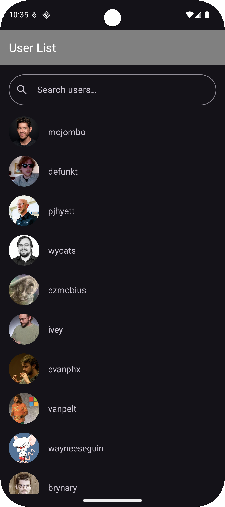
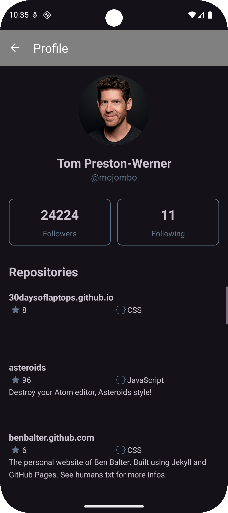
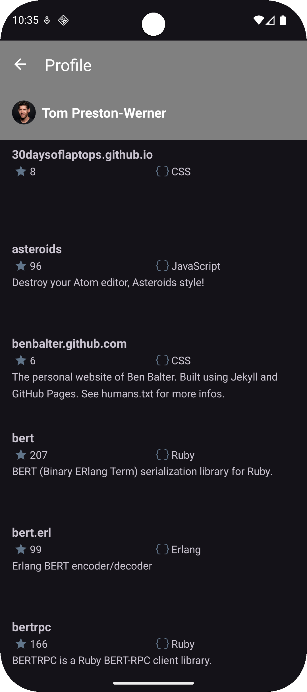
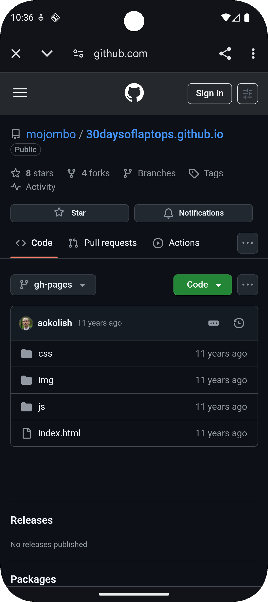

1. Please create the variable `github_api_token` in the `local.properties` file and enter your API key.
2. This project supports Android Meerkat or newer (requires AGP version newer than 8.10.1).
3. Avatar placeholder vectors are provided by [SVG Repo](https://www.svgrepo.com).
4. Four modules: 
   * `app`: Handles all Android and UI code
   * `domain`: Pure business logic and use-cases.
   * `data`: Implements repositories, network API calls, , and DTO ↔ Entity mapping. Encapsulates all data sources.
   * `core`: Provides shared utilities to avoid duplication.
5. Screenshot:
 
 
 
 
